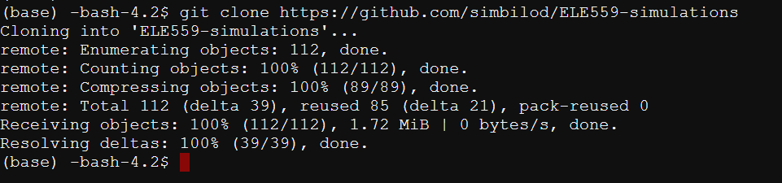
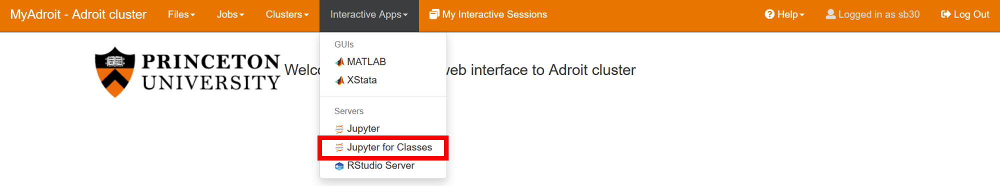
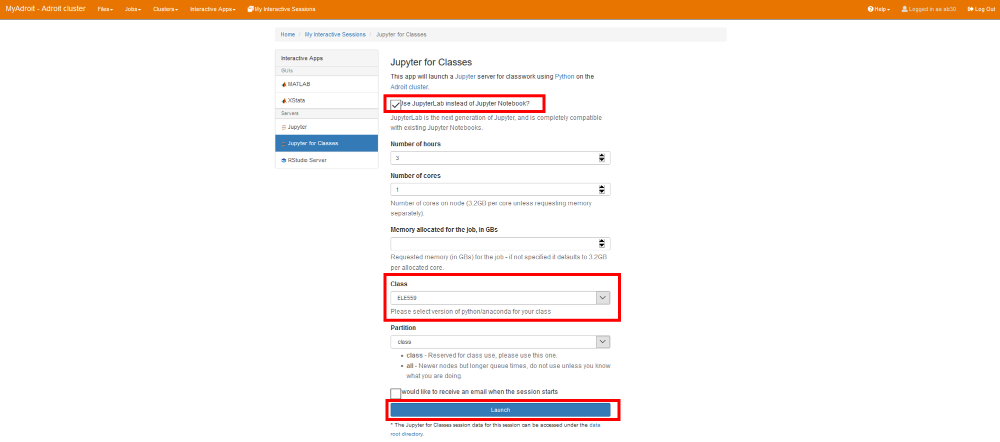
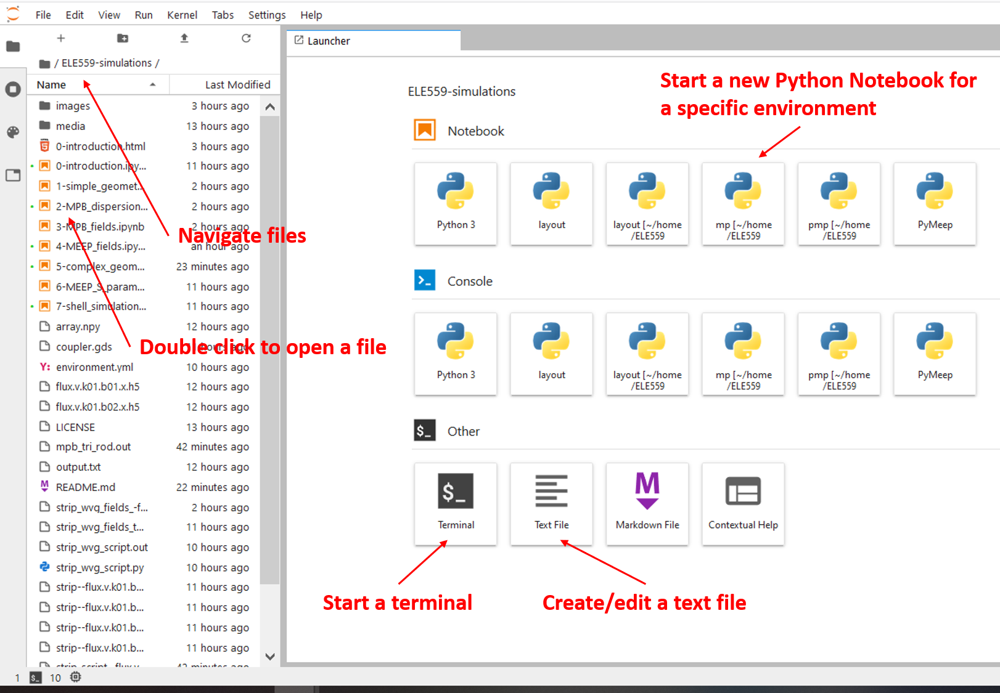

# CEE306_S2022
Python primer for Princeton's CEE306 class of Spring 2022

## Log in to Adroit

https://myadroit.princeton.edu/
Requesting access (Princeton students) : https://researchcomputing.princeton.edu/access

## Checkout environment

Navigate to the shell


Run this command :

```
git clone https://github.com/simbilod/CEE306_S2022.git
```


## Start up the Jupyter server

Under "My interactive sessions", click on Jupyter for classes :



Optionally, check the box for Jupyter Lab. Fill in your requested time and cores (be considerate to other users). Then click launch. When the environment is ready, launch it.



## Opening a Notebook

You will see an interface like this :



## Using a Notebook

Execute a cell by pressing `shift+enter`. The output will be displayed right underneath. The added text should provide enough context to follow!

More on Jupyter Notebooks : https://www.dataquest.io/blog/jupyter-notebook-tutorial/
